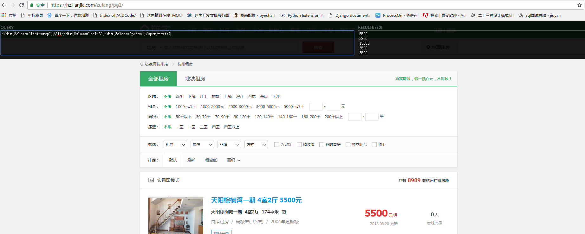

# sprider
房源信息分析  
过去一个月，全国热点城市的房租如脱缰野马。一线的房租同比涨了近20%。一夜醒来，无产青年连一块立锥之地都悬了。  
从2018下半年开始，租金海啸汹汹来袭，资本狂欢，官方默然，房东纠结，租客尖叫。这不是一方的过错，而更像是一场
全社会的“集体谋杀作品”。最令人不安的是，过去房地产的那套玩法和上涨逻辑，今天正在转移到房租上。
通过python获取某网站杭州的租房数据，来进行数据分析
页面分析
要爬取得字段

    

要爬取得字段
- 1.标题 title  
title=html.xpath('.//li/div[@class="info-panel"]/h2/a/@title')[i].replace(","," ")  
- 2.户型 room_type  
room_type=html.xpath('//div[@class="list-wrap"]//li//div[@class="where"]/span[@class="zone"]/span/text()')[i].replace("\xa0\xa0","")
- 3.面积 meters  
m=html.xpath('//div[@class="list-wrap"]//li//div[@class="where"]/span[@class="meters"]/text()')[i].replace("\xa0\xa0","")
- 4.建筑时间 time  
time=html.xpath('//div[@class="list-wrap"]//li//div[@class="con"]/text()[2]')[i]
- 5.所在楼层 floor  
floor=html.xpath('//div[@class="list-wrap"]//li//div[@class="con"]/text()[1]')[i]
- 6.价格 price  
price=html.xpath('//div[@class="list-wrap"]//li//div[@class="col-3"]/div[@class="price"]/span/text()')[i]
- 7.楼层总高 tatal_floor  
tatal_floor=re.findall('(\d+)',floor)[0]
- 8.更新时间 price_pre  
price_pre=html.xpath('//div[@class="price-pre"]/text()')[i][:-2]
- 9.具体位置 detail_place  
detail_place=re.findall("(\w+)租房",html.xpath('//div[@class="con"]/a/text()')[i])[0]
